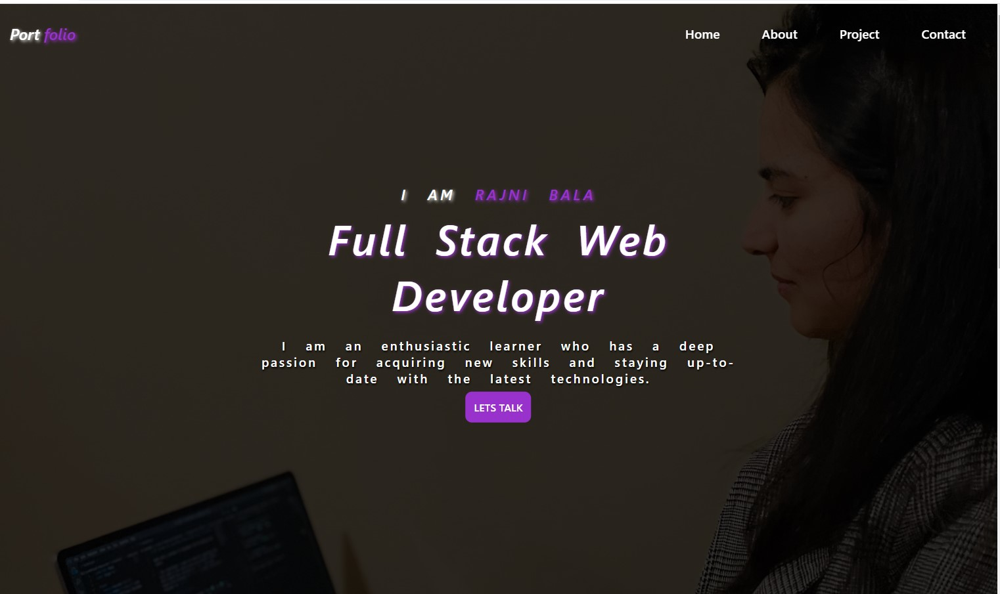

# 20 React: React Portfolio

## Description
Create a portfolio using your new React skills

## Table of Contents

- [User Story](#user-story)
- [Acceptance Criteria](#acceptance-criteria)
- [License](#license)
- [Installation](#installation)
- [Instructions](#instructions)
- [Contributing](#contributing)
- [Questions](#questions)


## User Story

```md
AS AN employer looking for candidates with experience building single-page applications
I WANT to view a potential employee's deployed React portfolio of work samples
SO THAT I can assess whether they're a good candidate for an open position
```

## Acceptance Criteria

```md
GIVEN a single-page application portfolio for a web developer
WHEN I load the portfolio
THEN I am presented with a page containing a header, a section for content, and a footer
WHEN I view the header
THEN I am presented with the developer's name and navigation with titles corresponding to different sections of the portfolio
WHEN I view the navigation titles
THEN I am presented with the titles About Me, Portfolio, Contact, and Resume, and the title corresponding to the current section is highlighted
WHEN I click on a navigation title
THEN I am presented with the corresponding section below the navigation without the page reloading and that title is highlighted
WHEN I load the portfolio the first time
THEN the About Me title and section are selected by default
WHEN I am presented with the About Me section
THEN I see a recent photo or avatar of the developer and a short bio about them
WHEN I am presented with the Portfolio section
THEN I see titled images of six of the developer’s applications with links to both the deployed applications and the corresponding GitHub repositories
WHEN I am presented with the Contact section
THEN I see a contact form with fields for a name, an email address, and a message
WHEN I move my cursor out of one of the form fields without entering text
THEN I receive a notification that this field is required
WHEN I enter text into the email address field
THEN I receive a notification if I have entered an invalid email address
WHEN I am presented with the Resume section
THEN I see a link to a downloadable resume and a list of the developer’s proficiencies
WHEN I view the footer
THEN I am presented with text or icon links to the developer’s GitHub and LinkedIn profiles, and their profile on a third platform (Stack Overflow, Twitter)
```
## License 
MIT License

## Installation
1. Clone the repository
2. Install the following: 
- npm install

## Instructions
💻   
Run the following command at the terminal:

`npm run start` <br>
- Go to http://localhost:3000/my-portfolio-website_rb to view the app on local server<br>

- Go to https://rbala16.github.io/my-portfolio-website_rb/ to view the functionality on live server

## Contributing
Rajni bala : (https://github.com/rbala16)

## Questions
✉️ Contact me with any questions: [Email:]bala12rajni@gmail.com , [Github](https://github.com/rbala16)<br />

## Mock-Up

The following screenshoot shows the web application's appearance and functionality:




## Review

You are required to submit BOTH of the following for review:

* The URL of the functional, deployed application.<br>
https://rbala16.github.io/my-portfolio-website_rb/

* The URL of the GitHub repository, with a unique name and a README that describes the project.<br>
https://github.com/rbala16/my-portfolio-website_rb
- - -
© 2023 edX Boot Camps LLC. Confidential and Proprietary. All Rights Reserved.
